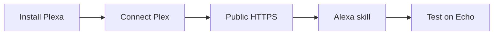

# Plexa

Self-hosted Plex music dashboard with a custom Alexa skill. Stream your Plex library in the browser and on Echo devices using a user-managed public HTTPS endpoint.

## Table of contents

- [Features](#features)
- [What you need](#what-you-need)
- [Setup overview](#setup-overview)
- [Quick start (development)](#quick-start-development)
- [Quick start (Docker)](#quick-start-docker)
- [Plex authentication](#plex-authentication)
- [Alexa integration](#alexa-integration)
- [Backup and restore](#backup-and-restore)
- [Environment variables](#environment-variables)
- [Project layout](#project-layout)
- [Scripts](#scripts)

## Features

- **Sign in with Plex** (OAuth) with manual token fallback
- Plex music library browsing (artists, albums, tracks) with detail views
- Global search across tracks, albums, artists, and playlists
- Browser playback with queue panel through Plexa's signed media gateway
- Playlist create, rename, delete, add/remove tracks, and reorder
- Custom Alexa skill with playlist/artist/album/track voice commands
- Guided staged setup in Settings (Plex → server → configuration)
- System / light / dark themes and accessible UI patterns
- Docker Compose deployment with persistent `/data` volume

## What you need

Before you start, make sure you have:

- **Plex Media Server** with at least one music library
- **Node.js 20+** (for local development) or **Docker** (for deployment)
- **Amazon Developer account** — required to create the Alexa skill ([sign up](https://developer.amazon.com/))
- **Public HTTPS access** — a reverse proxy, tunnel, or domain with TLS on port 443 so Alexa can reach your Plexa server

## Setup overview

Follow these steps in order. Steps 1–3 get Plexa running and connected to Plex; steps 4–6 enable voice control on Echo devices.



1. **Install and run Plexa** — use [Quick start (development)](#quick-start-development) or [Quick start (Docker)](#quick-start-docker) below.
2. **Connect Plex** — open **Settings → Plex Server**, sign in with Plex (OAuth), and choose your server.
3. **Expose Plexa over HTTPS** — configure a reverse proxy or tunnel so Alexa can reach `https://<your-host>/alexa`. Verify with `curl https://<your-host>/health`.
4. **Create the Alexa skill** — follow the **[Alexa setup guide](docs/setup-alexa.md)** to configure the Developer Console, import the interaction model, and set the skill endpoint.
5. **Finish Plexa configuration** — in **Settings → Configuration**, enter your public HTTPS URL, Alexa skill ID, invocation name, and locale. Select your music library.
6. **Test** — try the skill in the Developer Console, Alexa app, or on an Echo device.

The Settings page includes an **Alexa setup checklist** sidebar that mirrors the steps in the setup guide.

## Quick start (development)

```bash
cp .env.example .env
# Edit APP_SECRET, ADMIN_PASSWORD, and optional Plex/Alexa values

npm install
npm run dev
```

- API: `http://localhost:3000`
- Web UI (dev): `http://localhost:5173` (proxies API)

Default admin credentials come from `.env` (`ADMIN_USERNAME` / `ADMIN_PASSWORD`).

> **Alexa note:** Voice control requires the Plexa **API on port 3000**, not the Vite dev server on 5173. When exposing Plexa for Alexa, point your tunnel or reverse proxy at port 3000.

## Quick start (Docker)

Copy the example env file first:

```bash
cp .env.example .env
# Edit APP_SECRET, ADMIN_PASSWORD, and optional Plex/Alexa values
# Optional: set HOST_PORT=8080 in .env to expose Plexa on a different host port
```

Open `http://localhost:3000` after the container starts (or `http://localhost:$HOST_PORT` if you changed `HOST_PORT` in `.env`).

### Option A — Build from source

Uses the default [`compose.yaml`](compose.yaml) and builds the image locally:

```bash
docker compose up -d --build
```

### Option B — Use pre-built GHCR image

Uses [`compose.image.yaml`](compose.image.yaml) to pull a published image from GitHub Container Registry:

```bash
docker compose -f compose.image.yaml pull
docker compose -f compose.image.yaml up -d
```

Pin a specific version in `.env` or your shell:

```bash
PLEXA_IMAGE=ghcr.io/rupisaini123/plexa:0.1.0
```

See [Environment variables](#environment-variables) for all supported options.

## Plex authentication

Prefer **Sign in with Plex** in Settings. Plexa opens Plex-hosted authorization (supports 2FA), polls server-side, then lets you pick a server and music library. Only the resulting token is stored—never your Plex password.

Tokens are encrypted at rest with AES-256-GCM derived from `APP_SECRET`. Legacy XOR-encrypted tokens are migrated on read.

### Manual token fallback

1. Open Plex Web and navigate to any library item.
2. Click ⋯ → **Get Info** → **View XML**.
3. Copy the `X-Plex-Token` query parameter from the URL.
4. Paste the Plex URL and token under **manual token setup** in Settings.

Official guide: https://support.plex.tv/articles/204059436-finding-an-authentication-token-x-plex-token/

## Alexa integration

Plexa uses a **private custom Alexa skill** that you create in the [Alexa Developer Console](https://developer.amazon.com/alexa/console/ask). Alexa sends requests to `{PUBLIC_URL}/alexa` on your server. Plexa does **not** provision TLS—you provide your own reverse proxy, tunnel, or DNS setup with a trusted certificate on port 443.

**→ [Full Alexa setup guide](docs/setup-alexa.md)** — step-by-step instructions for HTTPS exposure, Developer Console configuration, Plexa Settings, testing, and troubleshooting.

The Settings page also includes an in-app **Alexa setup checklist** with a download button for a pre-filled interaction model.

## Backup and restore

SQLite data lives in `DATA_DIR` (default `./data`, Docker `/data`).

```bash
# Backup
cp data/plexa.db data/plexa.db.bak

# Restore (stop the app first)
cp data/plexa.db.bak data/plexa.db
```

With Docker Compose:

```bash
docker compose stop
docker run --rm -v plexa_plexa-data:/data -v "$PWD:/backup" alpine \
  cp /data/plexa.db /backup/plexa.db.bak
docker compose start
```

Keep `APP_SECRET` identical across restores so encrypted Plex tokens remain decryptable.

## Environment variables

| Variable | Required | Description |
|----------|----------|-------------|
| `HOST_PORT` | No | Host port mapped to container port 3000 (Docker Compose only; default `3000`) |
| `PLEXA_IMAGE` | No | Docker image for `compose.image.yaml` (default `ghcr.io/rupisaini123/plexa:latest`) |
| `APP_SECRET` | Yes | Encryption/signing secret (16+ chars) |
| `ADMIN_USERNAME` | No | Initial admin username (first boot) |
| `ADMIN_PASSWORD` | No | Initial admin password (first boot) |
| `DATA_DIR` | No | Persistent data directory |
| `PLEX_URL` | No | Default Plex server URL (optional seed) |
| `PLEX_TOKEN` | No | Default Plex token (optional seed; prefer OAuth) |
| `PUBLIC_URL` | No | Public HTTPS base URL (origin only, no `/alexa` suffix) |
| `ALEXA_SKILL_ID` | No | Alexa skill application ID |

## Project layout

- `src/` — Express API, Alexa handlers, Plex adapter/OAuth, media gateway
- `web/` — React + Tailwind CSS 4 dashboard
- `skill/` — Alexa interaction model, manifest template, icons
- `docs/` — setup guides (including [Alexa setup](docs/setup-alexa.md))
- `tests/` — Vitest + Supertest server tests

## Scripts

- `npm run dev` — API + web dev servers
- `npm run build` — production build
- `npm start` — run compiled server
- `npm test` — server + web tests
- `npm run lint` — ESLint
- `npm run typecheck` — TypeScript checks
