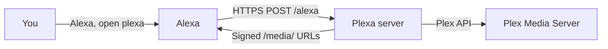

# Alexa Setup Guide

This guide walks you through connecting Plexa to Alexa so you can play your Plex music library by voice on Echo devices, the Alexa app, and the Developer Console simulator.

Plexa uses a **private custom Alexa skill** that you create manually in the [Alexa Developer Console](https://developer.amazon.com/alexa/console/ask). Alexa sends requests to your Plexa server at `https://<your-host>/alexa`; Plexa streams music from your Plex library in response.

## Overview



You will:

1. Expose Plexa over public HTTPS
2. Configure Plexa Settings (public URL, skill ID, music library)
3. Create and configure the skill in the Developer Console
4. Test on the console, phone, and Echo

## Before you begin

Make sure you have:

- An [Amazon Developer](https://developer.amazon.com/) account (same account as your Alexa app and Echo devices)
- Plexa running and reachable over **public HTTPS** on port 443
- Plex connected in Plexa **Settings → Plex Server** (Sign in with Plex or manual token)
- A **music library** selected in Plexa **Settings → Configuration**

The Settings page includes an **Alexa setup checklist** sidebar that mirrors these steps and offers a **Download interaction model** button pre-filled with your invocation name and locale.

## Step 1: Expose Plexa over HTTPS

Alexa requires a stable `https://<host>/alexa` endpoint on port 443 with a trusted certificate. Plexa does **not** provision TLS—you provide a reverse proxy, tunnel, or DNS setup.

### Cloudflare quick tunnel (development)

```bash
# Plexa API must be on port 3000 (not the Vite dev server on 5173)
cloudflared tunnel --url http://localhost:3000
```

Copy the `https://….trycloudflare.com` URL.

> **Note:** Quick-tunnel URLs change when you restart the tunnel. Update both Plexa Settings and the Alexa skill endpoint each time.

### Verify reachability

```bash
curl https://your-host.example.com/health
# {"ok":true,"service":"plexa"}
```

The web UI should also load at the same base URL if you are serving the built frontend from Plexa.

## Step 2: Configure Plexa

Open the Plexa web UI → **Settings → Configuration**:

| Field | Example | Notes |
|-------|---------|-------|
| Music library | *(select from dropdown)* | Required for Alexa playback |
| Public HTTPS URL | `https://your-host.example.com` | Origin only — **no** `/alexa` suffix |
| Alexa skill ID | `amzn1.ask.skill.xxxx-xxxx` | Copy from Developer Console after Step 3 |
| Invocation name | `plexa` | Must match the interaction model |
| Locale | `en-US` | Must match the skill language in the console |

You can also seed these in [`.env`](../.env.example):

```env
PUBLIC_URL=https://your-host.example.com
ALEXA_SKILL_ID=amzn1.ask.skill.xxxx-xxxx
```

The public URL is used to build signed `/media/` stream URLs for Alexa. The Alexa skill endpoint is `{PUBLIC_URL}/alexa`. Playback fails if the public URL is missing or wrong.

Use the **Download interaction model** button in the Settings checklist to get a JSON file pre-filled with your invocation name and locale. You will import this in Step 3.

## Step 3: Create the skill in the Developer Console

1. Open the [Alexa Developer Console](https://developer.amazon.com/alexa/console/ask).
2. **Create Skill** → **Custom**.
3. Choose a locale (e.g. **English (US)**) — must match Plexa Settings and your device language.
4. For hosting service, choose **Provision your own** (Plexa runs on your own HTTPS endpoint, not Alexa-hosted code).
5. Under **Build** → **Interfaces**, enable **Audio Player** only.
   - Do **not** enable HTML/APL interfaces unless you plan to support them.
   - **Required for playback.** If Audio Player is off, Alexa returns: *"Invalid Directive — the requested skill has not declared that it implements the audio player interface."*
6. Click **Save Interfaces**.
7. Upload icons from [`skill/icons/`](../skill/icons/) (see [`skill/icons/README.md`](../skill/icons/README.md) for sizes and export commands).
8. Under **Interaction Model** → **JSON Editor**, import the file you downloaded from Settings, or paste [`skill/interaction-model.json`](../skill/interaction-model.json).
9. Click **Save Model**, then **Build Model**. Wait for **Build Successful**.
   - Custom intents (play playlist, etc.) only work after a successful build. `open plexa` (LaunchRequest) can work even when the model failed to build.
10. Under **Endpoint**:
    - **HTTPS** → `https://<your-public-host>/alexa`
    - SSL certificate type: **My development endpoint is a sub-domain of a domain that has a wildcard certificate from a certificate authority** (works for `*.trycloudflare.com` and similar)
11. Copy the **Skill ID** (`amzn1.ask.skill.…`) from the skill overview into Plexa **Settings → Configuration**.
12. Under **Test**, switch to **Development** for your account.

Use [`skill/manifest.example.json`](../skill/manifest.example.json) as a reference for AudioPlayer-only configuration. See [`skill/README.md`](../skill/README.md) for interaction model notes and file reference.

## Step 4: Test

### Developer Console

1. Open the **Test** tab and ensure **Development** is enabled.
2. Try a launch:
   ```
   open plexa
   ```
   You should hear: *"Welcome to plexa. You can ask me to play a playlist, artist, album, or song."*
3. In the same session (no need to say "plexa" again):
   ```
   start the long drive playlist
   ```
4. Check **Skill I/O** for each utterance:
   - Request should show `PlayPlaylistIntent` (or another intent) with slot values.
   - Response may include `AudioPlayer.Play` directives for playback intents.

The console simulator does not render audio, but Skill I/O shows the directives Plexa sends.

### Phone (Alexa app)

1. Sign in to the **Alexa app** with the **same Amazon account** as the Developer Console.
2. Set language: **More** → **Settings** → **Alexa on This Phone** → **English (United States)** (must match skill locale).
3. Enable the dev skill: **Skills & Games** → **Your Skills** → **Dev** → find **Plexa** → **ENABLE TO USE**.
4. Use the two-step flow (most reliable):
   ```
   Alexa, open plexa
   ```
   then:
   ```
   start the long drive playlist
   ```

> **Why "play … playlist" may open Amazon Music:** Custom skills cannot be the default music player. Utterances like *"play the long drive playlist"* are often claimed by **Amazon Music** before Plexa is invoked, especially on the phone. Prefer collision-safe verbs:
>
> | Instead of | Use |
> |------------|-----|
> | play … playlist | **start** … playlist |
> | shuffle … playlist | **mix** … playlist |

One-shot examples that work better:

- *"Alexa, ask plexa to **start** the long drive playlist"*
- *"Alexa, ask plexa to **mix** Sample Artist"*

### Echo device

An Echo (or other Alexa speaker) is the most reliable device for **AudioPlayer** playback.

1. Register the Echo with the same Amazon account as your developer account.
2. Set device language to **English (US)** (or your skill locale).
3. Enable the dev skill (same as phone: **Your Skills** → **Dev**).
4. Say:
   ```
   Alexa, open plexa
   ```
   then:
   ```
   start the long drive playlist
   ```

## Recommended voice commands

| Intent | Example (after "Alexa, open plexa" or "Alexa, ask plexa to …") |
|--------|----------------------------------------------------------------|
| Play playlist | start the long drive playlist |
| Play playlist | start playlist long drive |
| Shuffle playlist | mix the road trip playlist |
| Play artist | start Sample Artist |
| Shuffle artist | mix Sample Artist |
| Play album | play the album Greatest Hits |
| Play song | play song Summer Nights by Sample Artist |

For track + artist, use a single phrase in the track slot (e.g. *"Summer Nights by Sample Artist"*). Alexa does not allow two `AMAZON.SearchQuery` slots in one utterance.

## Playback controls

While Plexa is playing audio, Alexa sends transport commands directly to the skill (no invocation name required for most built-ins):

| Control | Voice example | Behavior |
|---------|---------------|----------|
| Next | Alexa, next | Skips to the next track; stops at the end of the queue |
| Previous | Alexa, previous | Goes to the previous track; stops at the first track |
| Pause / resume | Alexa, pause / resume | Stops or resumes at the current position |
| Loop on | Alexa, loop on | Repeats the entire queue when the last track finishes |
| Loop off | Alexa, loop off | Stops after the last track (default) |
| Start over | Alexa, start over | Restarts the current track from the beginning |

Device **Next** and **Previous** buttons (Echo Show, Alexa app Now Playing, etc.) use `PlaybackController` requests and are handled the same way as voice next/previous.

Relative seeking requires the Plexa invocation name:

- *Alexa, ask plexa to skip forward 30 seconds*
- *Alexa, ask plexa to go back 15 seconds*
- *Alexa, ask plexa to skip forward* (defaults to 30 seconds)

**Note:** Alexa controls whether its native iOS Now Playing UI shows an enabled scrubber. If the slider is disabled, use the voice seek commands above.

## Troubleshooting

| Symptom | Likely cause | Fix |
|---------|--------------|-----|
| Skill does not respond | Public URL unreachable | Verify `curl https://<host>/health` |
| `open plexa` works; play commands do nothing | Interaction model not built | Fix build errors; remove invalid intents; **Build Model** again |
| Amazon Music Unlimited upsell | Skill not invoked; music domain collision | Enable dev skill on device; use **start**/**mix**; try two-step `open` then `start …` |
| "Sorry, that is not supported on this device" (phone) | Dev skill not enabled or locale mismatch | Enable under **Your Skills → Dev**; set **English (US)** |
| Invalid Directive / Audio Player not declared | Audio Player interface off | **Build → Interfaces → Audio Player** → Save → rebuild model |
| `applicationId mismatch` | Skill ID mismatch | Copy Skill ID from console into Plexa Settings |
| "I couldn't find a playlist called …" | Plex playlist name mismatch | Check exact playlist name in Plexa; try `start playlist <name>` |
| Playback fails / no audio | `PUBLIC_URL` wrong or `/media/` blocked | Set public URL to origin only (no `/alexa`); ensure `/media/` URLs are reachable without login |
| Next/Previous button does nothing | Old skill code or missing handler | Redeploy Plexa; device buttons use `PlaybackController` requests |
| Queue repeats forever | Loop mode on | Say *Alexa, loop off* |
| Seek slider disabled on iOS Alexa app | Alexa UI limitation for custom skills | Use *ask plexa to skip forward/back* voice commands |
| TLS errors | Certificate or tunnel issue | Use HTTPS on 443 with a trusted cert; for tunnels use wildcard CA option |
| Tunnel URL changed | Quick tunnel restarted | Update `PUBLIC_URL` and Alexa endpoint |
| Development mode expired | Console testing lapsed | Re-enable **Development** in Test tab |

## Security

- `/alexa` is not protected by admin login. Amazon request signature and timestamp verification are used, plus optional skill application ID enforcement when `ALEXA_SKILL_ID` is set.
- Media URLs are short-lived signed tokens and do not expose Plex tokens.
- Prefer Plex OAuth over pasting long-lived tokens in Settings.

## Related docs

- [Main README](../README.md) — project overview and quick start
- [skill/README.md](../skill/README.md) — interaction model notes and skill file reference
- [skill/icons/README.md](../skill/icons/README.md) — icon sizes and export commands
